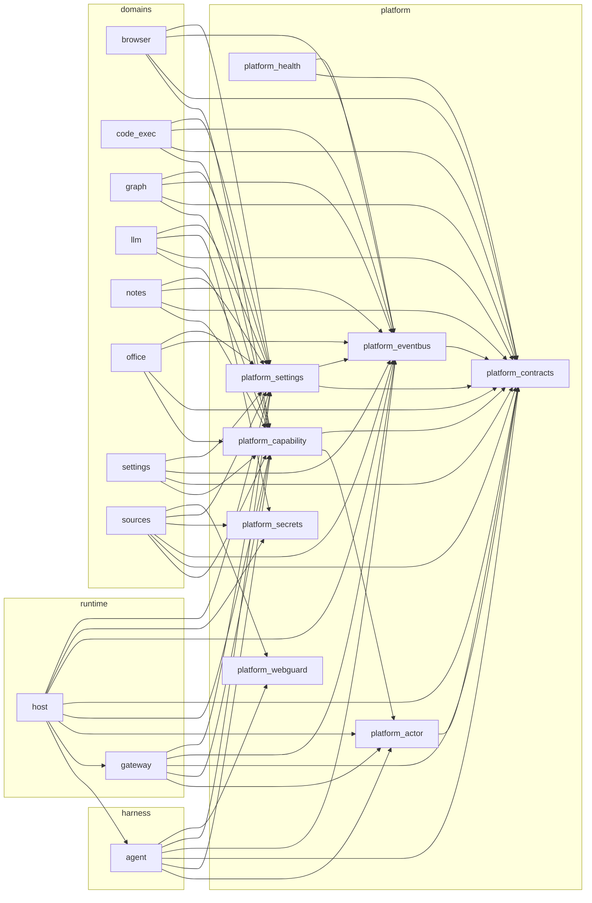

# Module dependency graph

English | [中文](module-graph.zh.md)

Generated by `scripts/gen_dep_graph.py` from the `root_packages` of
`import-linter.ini` (direct imports aggregated per top-level package).
Do not edit by hand; run `npm run graph` after changing imports.

